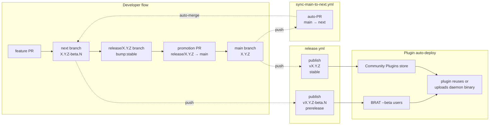
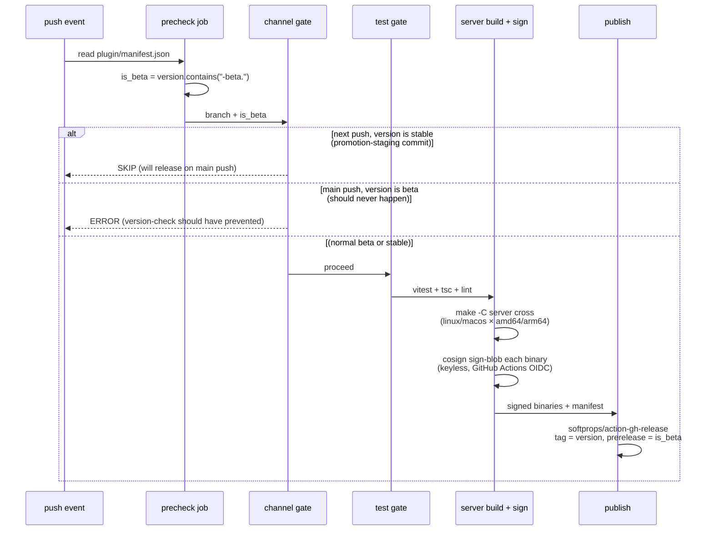
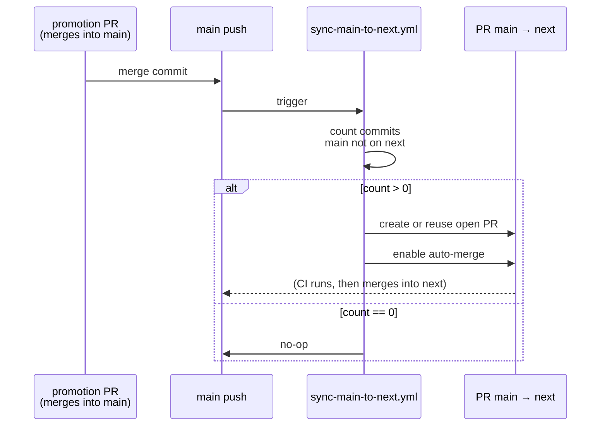
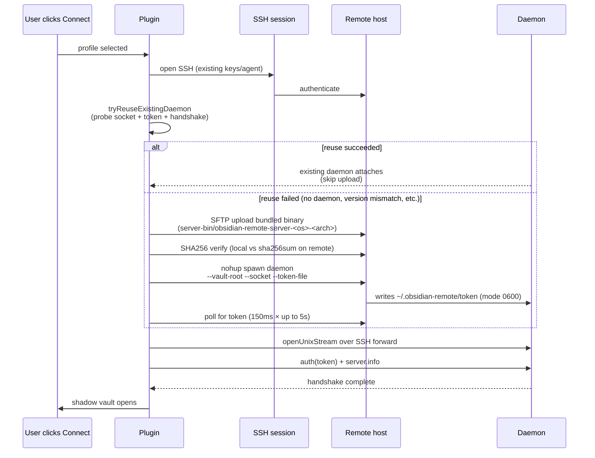

# Release & deploy pipeline

End-to-end design of how a code change goes from a merged PR to a signed binary running on a user's remote host. Covers the **two-channel release model** (next/beta + main/stable), the **release.yml** publish + sign pipeline, the **sync-main-to-next** back-sync workflow, and the **branch-aware lint/version-check pattern** with its subtle interaction with branch protection.

## TL;DR



## Two-channel model

| Channel | Branch | Version shape | Cadence | Audience |
|---|---|---|---|---|
| **Beta** | `next` | `X.Y.Z-beta.N` | Every merged PR | BRAT `--beta` testers |
| **Stable** | `main` | `X.Y.Z` (no suffix) | Manual promotion | Community Plugins store |

The version shape is **the single source of truth** for which channel a build belongs to:

- `release.yml` reads `plugin/manifest.json` and chooses `prerelease: true / false` based on whether the version contains `-beta.`.
- `version-check.yml` enforces that the right shape lives on the right branch.
- `bump-version.mjs` enforces it from the local side: a beta bump only touches `manifest-beta.json` (root) + `plugin/manifest.json`; a stable bump updates everything (root `manifest.json` + `versions.json` + the beta mirror, all in lockstep).

## release.yml — what fires when

Trigger: `push` to `main` OR `next`. One workflow, branch-aware.



### What gets attached to a release

For each tag (`X.Y.Z` or `X.Y.Z-beta.N`):

| Asset | Notes |
|---|---|
| `main.js`, `manifest.json`, `styles.css` | Plugin bundle for manual install |
| `manifest-beta.json` | BRAT `--beta` fetches this from HEAD; mirrored as a release asset |
| `obsidian-remote-server-{linux,darwin}-{amd64,arm64}` | 4 daemon binaries — the auto-deploy artefacts |
| `daemon-manifest.json` | `{filename: sha256}` map; one signature covers the whole set |
| `*.bundle` | Cosign signature per binary + per manifest |

### Promotion-staging skip

When the developer runs `npm run bump:stable` to drop the `-beta.N` suffix on a release branch, that commit eventually lands on `next` only momentarily (via the `release/X.Y.Z` branch's PR into main). If that branch were ever merged into `next` first, `release.yml` would see "stable version on next" and incorrectly publish. The precheck gate explicitly skips this case so only the eventual `main` push publishes the stable.

## sync-main-to-next.yml — closing the loop

After every push to `main`, this workflow opens a PR `head=main, base=next` to bring the merge commit back into `next` so the histories rejoin.



Without this, `next` would steadily diverge from `main` after every promotion (each promotion adds a merge commit on `main` that `next` doesn't have). The next promotion PR would then have to manually re-pull `main` into `next` — annoying and easy to forget.

### A quirk: branch protection vs job-level skip

The sync PR's CI runs the same suite as a normal PR — including `version-check.yml` and `commitlint.yml`. But the sync PR has no version change (both branches carry the same version) and includes autogenerated `Merge pull request #N from ...` titles that don't match Conventional Commits. So both checks need to **skip** their work on sync PRs.

**Important pattern**: when a required status check needs to skip on certain PR shapes, **the job must still run** and produce a `success` check-run. If you skip at the **job level** with `if: github.head_ref != 'main'`, GitHub Actions doesn't create a check-run at all → branch protection sees "expected but missing" → the merge is blocked indefinitely.

**Correct pattern**: skip at the **step level**. The job runs, but every functional step is gated by the `if:`, leaving only a `Skip note` step that prints why. The job completes green with zero meaningful work done, branch protection sees `success`, the sync PR can merge.

This was learned the hard way during the v1.0.44 stable promotion — the auto-opened sync PR could not merge until both workflows were rewritten to step-level skips.

## version-check.yml — branch-aware semver enforcement

Triggers on `pull_request` into `main` or `next`. Asserts:

| Check | All PRs | PR → next (beta) | PR → main (stable) |
|---|:-:|:-:|:-:|
| `plugin/manifest.json.version == plugin/package.json.version` | ✓ | ✓ | ✓ |
| `plugin/manifest.json == manifest-beta.json` (root, byte equality) | ✓ | ✓ | ✓ |
| Head version > base version (semver-aware) | ✓ | ✓ | ✓ |
| Root `manifest.json` must NOT have moved vs base | — | ✓ | — |
| `versions.json` (both copies) must NOT have moved vs base | — | ✓ | — |
| Head version is plain `X.Y.Z` (no `-beta.N`) | — | — | ✓ |
| `plugin/manifest.json == manifest.json` (root) | — | — | ✓ |
| `plugin/versions.json == versions.json` (root) | — | — | ✓ |

Sync PRs (head_ref=main) skip the whole gate at the step level (see the quirk note above).

The semver compare uses Node so prerelease ordering is correct: `1.0.44-beta.10 > 1.0.44-beta.2`, `1.0.44 > 1.0.44-beta.N`.

## How a developer cuts a stable release

The full flow per [`CONTRIBUTING.md` → Cutting a promotion](https://github.com/sotashimozono/obsidian-remote-ssh/blob/next/CONTRIBUTING.md#cutting-a-promotion-next--main):

```bash
git checkout -b release/X.Y.Z next
cd plugin
npm run bump:stable          # X.Y.Z-beta.N → X.Y.Z (drops -beta suffix)
git commit -am "release: prepare X.Y.Z promotion"
git push origin release/X.Y.Z
gh pr create --base main --head release/X.Y.Z \
  --title "release: promote next → main (X.Y.Z)"
```

The release-branch indirection means the bump commit is **fully CI-validated** (commitlint, version-check, lint, type-check, tests) before it reaches `main`. No admin bypass on `next` or `main` is needed. After CI green and merge:

1. **`release.yml` fires on the main push** → publishes **vX.Y.Z** stable + cosign-signed binaries + GitHub Release marked as latest.
2. **`sync-main-to-next.yml` fires on the main push** → opens auto-merging PR `main → next` so `next` gets the merge commit.
3. The next beta cycle starts on a normal `feat/...` branch with `npm run bump:beta:start` (`X.Y.Z → X.Y.(Z+1)-beta.0`).

## Plugin-side deploy — what happens when a user connects

The "deploy" half of "release & deploy" is what the plugin does at connect time, using the binaries `release.yml` published.



The bundled binary in `server-bin/` is exactly the cosign-signed binary that was attached to the latest release — the plugin's build script copies it into the bundle from `server/dist/`.

## Versions of artefacts at any point in time

For a vault with the plugin installed at version `X.Y.Z`:

| Artefact | Where | What version |
|---|---|---|
| Plugin bundle (`main.js`) | `<vault>/.obsidian/plugins/remote-ssh/main.js` | `X.Y.Z` (matches `plugin/manifest.json`) |
| Bundled daemon binary | `<vault>/.obsidian/plugins/remote-ssh/server-bin/...` | Built against `X.Y.Z` (matches what release.yml signed) |
| Deployed daemon binary on remote | `~/.obsidian-remote/server` | Either the bundled `X.Y.Z` (after first connect or after reuse failed) OR a different version if you pre-deployed via systemd |
| Daemon's reported `server.info.version` | (queried at handshake) | Whatever was uploaded; the plugin's reuse probe handshakes — version mismatch causes fall-through to redeploy |

The reuse probe + handshake check is what keeps the on-remote daemon version in lockstep with the plugin bundle without forcing a redeploy on every connect.

## See also

- [[en/server/auto-deploy|Plugin auto-deploy]] — step-by-step from the user's perspective
- [[en/server/signing|Binary signing]] — cosign internals
- [[en/security/cosign-verify|Cosign verify]] — how a user verifies a binary
- [[en/contributing/documentation|Contributing — docs]] — when to add to this page vs. the user-facing pages
- [`CONTRIBUTING.md` → Branching model](https://github.com/sotashimozono/obsidian-remote-ssh/blob/next/CONTRIBUTING.md#branching-model--next-beta--main-stable) — the canonical channel description for contributors
