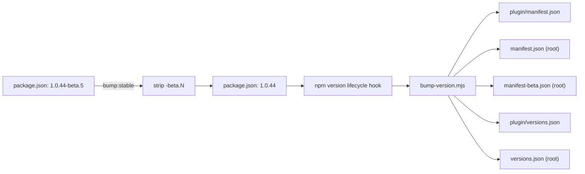

# Release flow

Step-by-step for cutting releases — both beta (every merge to `next`) and stable (manual promotion). Complements the system-level [[en/architecture/release-pipeline|Release & deploy pipeline]] architecture page.

## Beta releases — automatic

Every merge to `next` becomes a beta release. As a contributor you do not run anything by hand:

1. Open a PR from your `feat/...` (or `fix/...` etc.) branch into `next`.
2. Bump the beta version on your branch:
   ```bash
   cd plugin
   npm run bump:beta            # X.Y.Z-beta.N → X.Y.Z-beta.(N+1)
   ```
   Use `npm run bump:beta:start` only when starting a fresh cycle right after a stable promotion (when `next` carries a plain `X.Y.Z` and needs a `-beta.0`).
3. Commit, push, get review, merge.
4. `release.yml` fires on the `next` push and publishes `vX.Y.Z-beta.N` as a GitHub prerelease with cosign-signed daemon binaries. BRAT consumers pick it up on next launch.

## Stable releases — promote `next` → `main`

**`main` only ever receives merges from `next`. There is no `release/*` branch.**
To cut a stable release you bump `next` to the stable version *first*, then
promote `next` to `main` directly.

```bash
# 1. Bump next to the stable version — a normal branch, PR'd INTO next.
git checkout -b release-X.Y.Z next
cd plugin
npm run bump:stable          # 1.0.44-beta.5 → 1.0.44 (drops the -beta suffix)
git commit -am "release: X.Y.Z (stable)"
git push origin release-X.Y.Z
gh pr create --base next --head release-X.Y.Z --title "release: X.Y.Z (stable)"
```

The bump is fully CI-validated by its PR **into `next`** — commitlint,
version-check (which accepts a plain `X.Y.Z` on `next` as a *promotion-staging*
shape), lint, type-check, tests. No admin override needed. `release.yml` does
**not** publish on this `next` push: a stable version on `next` is recognised
as a staging commit and skipped; the `main` push is what releases.

Once it merges (`next` now carries the stable `X.Y.Z`), promote:

```bash
gh pr create --base main --head next --title "promote: next → main (X.Y.Z)"
```

After the promotion merges into `main`:

1. `release.yml` fires on the main push → publishes **vX.Y.Z** stable +
   cosign-signed binaries + the GitHub Release (notes auto-generated across the
   whole beta cycle).
2. `sync-main-to-next.yml` opens an auto-merging `main → next` PR. Because
   `next` and `main` are now the **same** `X.Y.Z`, it merges with **no version
   conflict**.
3. Start the next beta cycle with `npm run bump:beta:start`
   (`X.Y.Z → X.Y.(Z+1)-beta.0`) on the first feature branch.

> **Why bump on `next` rather than a `release/` branch → `main`?** Keeping the
> stable bump on `next` means `main` and `next` never diverge on the version
> files, so the post-release `main → next` sync is a clean auto-merge instead of
> a manual version-file conflict on every release. The bump still goes through
> full CI (via its PR into `next`), and `main` only ever merges from `next`.

## What `bump:stable` does



The script (`plugin/scripts/bump-stable.mjs`) reads the current `-beta.N` suffix, strips it, runs `npm version <stripped>`. The `version` lifecycle hook calls `bump-version.mjs` which detects the plain version and updates **all** five manifest files (vs. a beta bump which only touches the bundled manifest + the BRAT mirror — see [[en/architecture/release-pipeline|Release pipeline]] for why).

## Hot-fixing a shipped stable release

`main` only ever merges from `next`, so even an urgent fix goes through
`next` — just fast-tracked, not branched off `main`:

1. Branch off `next`: `git checkout -b hotfix-X.Y.Z next`.
2. Make the fix and bump to the patch stable: `cd plugin && npm version patch
   --no-git-tag-version` (`1.0.44 → 1.0.45`; `bump:stable` doesn't apply —
   there's no `-beta` suffix to strip).
3. PR **into `next`** (version-check accepts the plain `X.Y.Z` promotion-staging
   shape), merge, then immediately promote `next → main` as above.
4. The `main → next` sync afterwards is a clean auto-merge — same version on
   both branches.

## Pre-release sanity checks

Before opening the promotion PR, on the release branch:

```bash
# Plugin builds clean
cd plugin
npm run build               # esbuild production bundle

# Tests pass locally
npm test                    # vitest unit tests

# Server cross-builds
make -C ../server cross     # 4 binaries land in server/dist/

# Optional: verify the daemon binary you'll ship matches the
# previous release's signature chain
cosign verify-blob \
  --bundle ../server/dist/obsidian-remote-server-linux-amd64.bundle \
  --certificate-identity-regexp \
    'https://github.com/sotashimozono/obsidian-remote-ssh/.github/workflows/release.yml@.*' \
  --certificate-oidc-issuer https://token.actions.githubusercontent.com \
  ../server/dist/obsidian-remote-server-linux-amd64
```

CI runs the same checks on the release branch's PR, so this is paranoia, not gating — useful when you'd rather find a problem before the PR is open.

## What the release pipeline does NOT cover

- **Documentation site deploy** — handled by `docs.yml` (separate workflow, triggers on changes to `docs/**` and `docs-site/**`).
- **Container image builds** — `deploy/docker/` is built smoke-test in CI but not pushed anywhere.
- **Notifications** — no Slack/Discord/email hooks; subscribe to GitHub Releases (Watch → Custom → Releases).

## See also

- [[en/architecture/release-pipeline|Release & deploy pipeline]] — the design behind release.yml + sync workflow + version-check
- [[en/contributing/development-setup|Development setup]] — getting the dev environment working
- [[en/changelog|Changelog & releases]] — major-milestone overview
- [`CONTRIBUTING.md` → Branching model](https://github.com/sotashimozono/obsidian-remote-ssh/blob/next/CONTRIBUTING.md#branching-model--next-beta--main-stable) — canonical contributor reference
