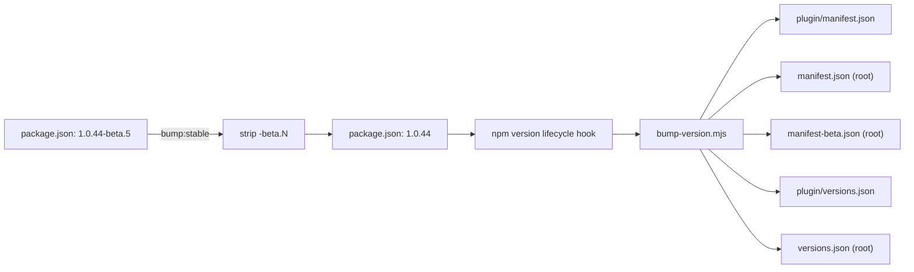

# Release flow

Step-by-step for cutting releases — both beta (every merge to `next`) and stable (manual promotion). Complements the system-level [[en/architecture/release-pipeline|Release & deploy pipeline]] architecture page.

## Beta releases — automatic

Every merge to `next` becomes a beta release. As a contributor you do not run anything by hand:

1. Open a PR from your `feat/...` (or `fix/...` etc.) branch into `next`.
2. Bump the beta version on your branch:
   ```bash
   cd plugin
   npm run bump:beta            # X.Y.Z-beta.N → X.Y.Z-beta.(N+1)
   ```
   Use `npm run bump:beta:start` only when starting a fresh cycle right after a stable promotion (when `next` carries a plain `X.Y.Z` and needs a `-beta.0`).
3. Commit, push, get review, merge.
4. `release.yml` fires on the `next` push and publishes `vX.Y.Z-beta.N` as a GitHub prerelease with cosign-signed daemon binaries. BRAT consumers pick it up on next launch.

## Stable releases — promotion via release branch

When `next` has accumulated enough verified work to ship as the next stable, the **promotion flow** is:

```bash
git checkout -b release/X.Y.Z next
cd plugin
npm run bump:stable          # 1.0.44-beta.5 → 1.0.44 (drops -beta suffix)
git commit -am "release: prepare X.Y.Z promotion"
git push origin release/X.Y.Z
gh pr create --base main --head release/X.Y.Z \
  --title "release: promote next → main (X.Y.Z)"
```

The release branch is critical — it gives the bump commit a place to be CI-validated (commitlint, version-check, lint, type-check, tests, integration) **before** it reaches `main`. No admin override on `next` or `main` is needed.

After the PR is reviewed and merged into `main`:

1. `release.yml` fires on the main push → publishes **vX.Y.Z** stable + cosign-signed binaries + GitHub Release marked latest.
2. `sync-main-to-next.yml` fires on the same main push → opens an auto-merging PR `main → next` so the merge commit rejoins.
3. The next beta cycle starts on a normal `feat/...` branch with `npm run bump:beta:start` (`X.Y.Z → X.Y.(Z+1)-beta.0`).

## What `bump:stable` does



The script (`plugin/scripts/bump-stable.mjs`) reads the current `-beta.N` suffix, strips it, runs `npm version <stripped>`. The `version` lifecycle hook calls `bump-version.mjs` which detects the plain version and updates **all** five manifest files (vs. a beta bump which only touches the bundled manifest + the BRAT mirror — see [[en/architecture/release-pipeline|Release pipeline]] for why).

## Hot-fixing main without going through next

If `main` has a critical bug that can't wait for the next promotion:

1. Branch off `main` directly: `git checkout -b hotfix/X.Y.Z main`
2. Make the fix + bump: `npm version patch --no-git-tag-version` to go `1.0.44 → 1.0.45`. (`bump:stable` won't help here — there's no `-beta` suffix to strip.)
3. PR into `main`. version-check requires the head version to be plain `X.Y.Z` strictly greater than base — same rule as a normal promotion.
4. After merge, the `sync-main-to-next.yml` workflow back-syncs to `next` automatically.

## Pre-release sanity checks

Before opening the promotion PR, on the release branch:

```bash
# Plugin builds clean
cd plugin
npm run build               # esbuild production bundle

# Tests pass locally
npm test                    # vitest unit tests

# Server cross-builds
make -C ../server cross     # 4 binaries land in server/dist/

# Optional: verify the daemon binary you'll ship matches the
# previous release's signature chain
cosign verify-blob \
  --bundle ../server/dist/obsidian-remote-server-linux-amd64.bundle \
  --certificate-identity-regexp \
    'https://github.com/sotashimozono/obsidian-remote-ssh/.github/workflows/release.yml@.*' \
  --certificate-oidc-issuer https://token.actions.githubusercontent.com \
  ../server/dist/obsidian-remote-server-linux-amd64
```

CI runs the same checks on the release branch's PR, so this is paranoia, not gating — useful when you'd rather find a problem before the PR is open.

## What the release pipeline does NOT cover

- **Documentation site deploy** — handled by `docs.yml` (separate workflow, triggers on changes to `docs/**` and `docs-site/**`).
- **Container image builds** — `deploy/docker/` is built smoke-test in CI but not pushed anywhere.
- **Notifications** — no Slack/Discord/email hooks; subscribe to GitHub Releases (Watch → Custom → Releases).

## See also

- [[en/architecture/release-pipeline|Release & deploy pipeline]] — the design behind release.yml + sync workflow + version-check
- [[en/contributing/development-setup|Development setup]] — getting the dev environment working
- [[en/changelog|Changelog & releases]] — major-milestone overview
- [`CONTRIBUTING.md` → Branching model](https://github.com/sotashimozono/obsidian-remote-ssh/blob/next/CONTRIBUTING.md#branching-model--next-beta--main-stable) — canonical contributor reference
