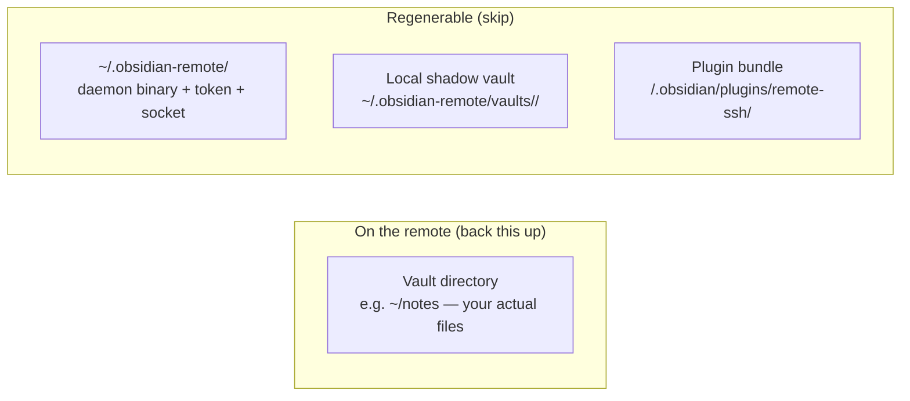

# Backup & restore

The plugin doesn't run its own backup. Your **vault files on the remote** are the only thing that matters; everything else is regenerable. This recipe walks through what to actually back up, where it lives, and how to restore.

## What's worth backing up



| Path | Back up? | Why |
|---|:-:|---|
| `<vault root>` on the remote (e.g. `/home/pi/notes/`) | **Yes** | Your actual notes — the irreplaceable bit |
| `~/.obsidian-remote/server` (daemon binary) | No | Re-uploaded by the plugin on next connect |
| `~/.obsidian-remote/token` | No | Regenerated on every daemon restart |
| `~/.obsidian-remote/server.log` | Optional | Useful for post-incident debugging; rotates anyway |
| `~/.obsidian-remote/vaults/<id>/` (local shadow) | No | Re-fetched from the remote on next connect |
| `<vault>/.obsidian/plugins/remote-ssh/` | No | Re-installed via Community Plugins / BRAT / manual |
| `<vault>/.obsidian/plugins/remote-ssh/data.json` | Maybe | Holds your profile list + host-key fingerprints. Convenient to back up but easy to recreate if lost. |

## Three approaches by complexity

### 1. rsync to a second host (lowest setup)

```bash
# On the remote, daily cron:
0 3 * * * rsync -aHx --delete-after \
  /home/pi/notes/ \
  backup-host:/srv/backups/notes/
```

`-a` preserves permissions, `-H` preserves hard links (Obsidian doesn't use them but it's cheap), `-x` stops at filesystem boundaries. `--delete-after` means deletions on the source propagate.

This is fine for a single backup target with no historical retention.

### 2. restic (versioned, deduplicated)

```bash
# One-time setup
sudo apt install restic
restic init --repo /mnt/backup-disk/restic-vault

# Daily snapshot (cron)
0 3 * * * restic --repo /mnt/backup-disk/restic-vault \
  backup /home/pi/notes \
  --tag daily

# Weekly retention prune
0 4 * * 0 restic --repo /mnt/backup-disk/restic-vault \
  forget --keep-daily 14 --keep-weekly 8 --keep-monthly 12 \
  --prune
```

restic gives you:
- Per-file deduplication (notes that don't change between snapshots take ~no space)
- Encryption at rest (the repo is encrypted with your passphrase)
- Point-in-time restore (`restic restore <snapshot-id> --target /tmp/restore`)
- Native S3 / B2 / SFTP / rclone backends if you want off-site

This is the recommended path for a vault you care about.

### 3. borg / tarsnap (similar tier)

[borg](https://borgbackup.readthedocs.io/) and [tarsnap](https://www.tarsnap.com/) cover the same ground as restic with different trade-offs (borg is broadly similar; tarsnap is a paid encrypted-cloud service with strong reputation but no local mode). Pick whichever you already trust.

## Restore scenarios

### A. Specific note deleted by mistake

The plugin's [[en/user-guide/conflicts|conflict handling]] flow does **not** create backups of overwrites — there's no `.bak` recovery (see the page's warning). For a single note, restore from your latest backup:

```bash
# restic
restic --repo /mnt/backup-disk/restic-vault \
  restore latest --target /tmp/restore --include /home/pi/notes/lost-note.md
cp /tmp/restore/home/pi/notes/lost-note.md /home/pi/notes/
```

The plugin's `fs.watch` subscription will pick the file up automatically — your in-Obsidian view refreshes within ~500 ms.

### B. Whole vault corrupted / ransomware / disk failure

If the remote's vault directory is gone or corrupted:

1. Stop the daemon so it doesn't write into the broken state:
   ```bash
   pkill -f obsidian-remote-server
   ```
2. Restore the vault from backup:
   ```bash
   restic --repo /mnt/backup-disk/restic-vault \
     restore latest --target /tmp/restore --include /home/pi/notes
   rsync -aHx --delete /tmp/restore/home/pi/notes/ /home/pi/notes/
   ```
3. Reconnect from the plugin. The auto-deploy redeploys a fresh daemon (since the previous socket + token are gone) and the shadow vault re-syncs from the restored remote.

### C. Remote host is dead — restore to a new host

See [[en/cookbook/host-migration|Migrating between hosts]] for the full walkthrough. The short version: spin up a new host, restore the vault to it, update the plugin profile's `Host` field, reconnect (TOFU prompt for the new host key), done.

### D. Local laptop died (you have the remote, no backup needed)

Install the plugin on a new laptop. Re-add the same profile (Host / port / user / SSH key). On first connect:

- Host-key TOFU dialog appears (the new laptop's host-key store is empty)
- Trust the fingerprint
- Plugin reuses the running daemon if it's still up, else redeploys
- Shadow vault re-fetches from the remote

Workspace state (open tabs, pane sizes) lives in the remote's `.obsidian/user/<client-id>/` subtree per [[en/configuration/this-device|This device]]. If you keep the same `Client ID` on the new laptop, the new Obsidian opens with the same layout. If you change it, you start fresh.

## What about Obsidian's own snapshot features?

Obsidian's "File recovery" core plugin keeps per-file snapshot history **inside the vault** (`.obsidian/snapshots/`). Because the vault lives on the remote in our model, those snapshots ARE on the remote and ARE captured by your remote-side backup automatically. You don't need to do anything special.

Same for the "Sync" core plugin's history feature — that uses Obsidian Sync (which we're replacing); it doesn't apply.

## See also

- [[en/cookbook/host-migration|Migrating between hosts]] — full vault relocation
- [[en/user-guide/conflicts|Conflict handling]] — important context on the lack of automatic conflict-side backups
- [[en/server/raspberry-pi|Server / Raspberry Pi notes]] — relevant for "vault on SD card" durability discussion
