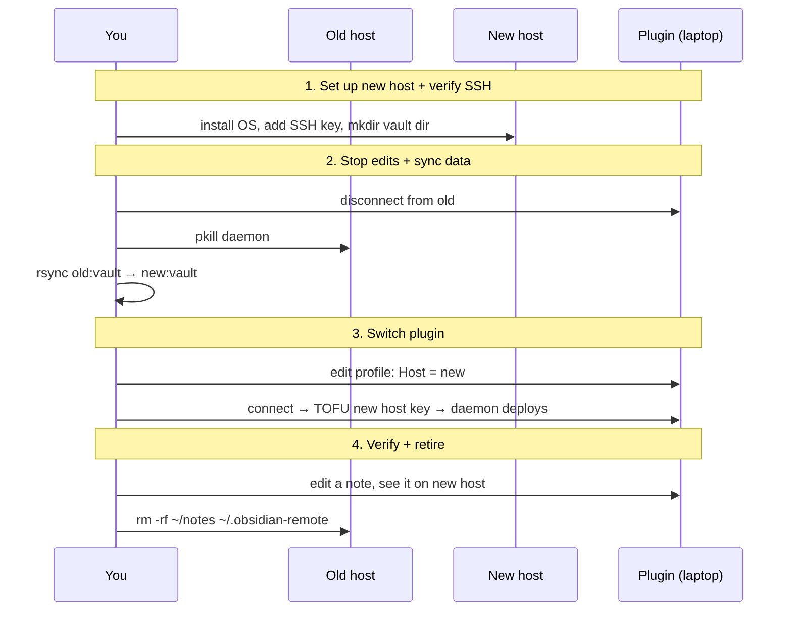

# Migrating between hosts

Move your vault from one remote host to another (Pi → NAS, home server → VPS, old hardware → new) with no edit gap and no surprises. Takes ~15 minutes for a moderate vault.

## Plan



## Step 1 — Set up the new host

Whatever the new host is (RPi, NAS, VPS), make sure:

- SSH is reachable from your laptop (`ssh user@new-host` works, no password)
- The vault directory exists: `ssh user@new-host 'mkdir -p ~/notes'`
- Disk has enough space — `du -sh /home/pi/notes` on the old host is your floor

For a Pi setup from scratch, see [[en/cookbook/raspberry-pi-vault|Raspberry Pi vault from scratch]].

## Step 2 — Stop edits + copy the vault

**Disconnect from the plugin** so no in-flight writes interleave with the copy:

- Command palette → "Remote SSH: Disconnect"
- Or close the shadow vault window

**Stop the daemon on the old host** (defensive — already disconnected, but the daemon may still be running waiting for reconnect):

```bash
ssh old-host 'pkill -f obsidian-remote-server'
```

**Copy the vault** with rsync. From your laptop (so the laptop is the rendezvous; or you can hop between hosts directly if they can reach each other):

```bash
# Pull from old to laptop, push to new
ssh old-host 'tar czf - -C /home/pi notes' | \
ssh new-host 'tar xzf - -C /home/pi'

# OR — host-to-host if they can reach each other
ssh old-host 'rsync -aHx /home/pi/notes/ new-host:/home/pi/notes/'
```

`rsync` is faster on subsequent runs (delta transfer); `tar | tar` is fine for a one-shot.

**Verify** the copy is byte-equivalent:

```bash
old=$(ssh old-host 'cd /home/pi/notes && find . -type f -exec sha256sum {} +' | sort -k2 | sha256sum)
new=$(ssh new-host 'cd /home/pi/notes && find . -type f -exec sha256sum {} +' | sort -k2 | sha256sum)
[ "$old" = "$new" ] && echo OK || echo MISMATCH
```

## Step 3 — Switch the plugin profile

In **Settings → Remote SSH → Profiles → My host**:

- Update `Host` to the new hostname/IP
- Leave everything else (Port, Username, Auth, Remote vault path) — same as old as long as paths align

Save.

**Connect**. The first connect to the new host will:

1. Show a **TOFU dialog** with the new host's key fingerprint. Verify out-of-band (console session on the new host: `ssh-keygen -lf /etc/ssh/ssh_host_ed25519_key.pub`) before clicking **Trust & remember**. See [[en/security/host-keys|Host-key trust]].
2. Upload + verify the daemon binary (~5 s).
3. Open the shadow vault — same content, same in-Obsidian layout (because per-client `.obsidian/user/<client-id>/` came along in the rsync).

## Step 4 — Verify the new host is canonical

In Obsidian, edit a note. Then on the new host:

```bash
ssh new-host 'ls -lt /home/pi/notes | head -3'
```

Your edit should be on top with a recent mtime. The plugin is now talking to the new host.

## Step 5 — Retire the old host

Once you're satisfied:

```bash
# Remove the daemon's working directory
ssh old-host 'rm -rf ~/.obsidian-remote'

# Optional: remove the vault directory IF you have a backup elsewhere
# (Probably wait a few days first, in case you spot something missing)
ssh old-host 'rm -rf /home/pi/notes'

# Remove the old host's fingerprint from your plugin's known-host store
# (so a future profile pointing at the same hostname re-prompts TOFU)
# Edit data.json under <vault>/.obsidian/plugins/remote-ssh/
# and delete the "<old-host>:22" key from hostKeyStore.
```

## Variations

### Migrating with edits in flight (zero-downtime)

If you have collaborators editing the same vault from other devices, stopping all edits is impractical. Approximation:

1. Schedule a "switchover window" (post a note in your shared channel: "vault read-only 18:00-18:15")
2. Have everyone disconnect at 18:00
3. Do the rsync, switch, verify
4. Tell people to update their profile's `Host` field and reconnect

There's no built-in dual-master mode; some delta will leak in either direction if people don't actually disconnect. The conflict-handling flow handles it but is unforgiving (no automatic backup of the rejected side — see [[en/user-guide/conflicts|Conflict handling]]).

### Old host truly dead (no `ssh old-host` possible)

Restore from your backup to the new host instead of rsyncing live. See [[en/cookbook/backup-restore#restore-scenarios|Backup → restore scenarios]] (scenario C).

### Different vault path on the new host

If the new host's vault path is different (e.g., old was `/home/pi/notes`, new is `/srv/vault`):

1. rsync to the new path: `ssh old-host 'tar czf - -C /home/pi notes' | ssh new-host 'tar xzf - -C /srv && mv /srv/notes /srv/vault'`
2. Update the profile's **Remote vault path** field too (in addition to Host)

## See also

- [[en/cookbook/raspberry-pi-vault|Raspberry Pi vault from scratch]] — for the "set up new host" step
- [[en/cookbook/backup-restore|Backup & restore]] — complementary; backup is the prerequisite for "old host truly dead" migrations
- [[en/security/host-keys|Host-key trust]] — what the TOFU dialog on first connect to the new host means
