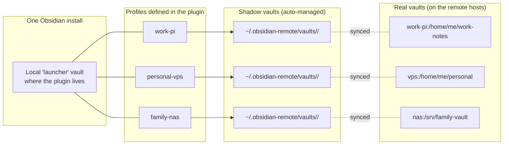

# Editing multiple vaults from one Obsidian

Run several SSH profiles from a single Obsidian install — work vault on one host, personal vault on another, family-shared vault on a third. The plugin supports this natively; this recipe walks through the model + the few sharp edges.

## The model

- **One launcher vault** holds the plugin + its profile list (`data.json`).
- **One profile per remote vault** in plugin settings.
- Each profile spawns its **own shadow vault** at `~/.obsidian-remote/vaults/<profile-id>/` when you connect.
- Each shadow vault is a real Obsidian vault on disk — Obsidian opens it as a separate window.

So at any moment you can have 0, 1, 2, or 3 shadow vault windows open in parallel. The launcher vault stays open in its own window as the "control panel".

## Setting it up

### 1. Pick a launcher vault

Any vault works. Many users dedicate a small "Hub" vault for this purpose — minimal content, just the plugin + maybe a README explaining the setup. Others use their everyday local vault as the launcher.

### 2. Add profiles

Settings → Remote SSH → **Add profile** → repeat for each remote.

Profile naming tip: prefix with the host context for quick scanning in the connect menu — `work-pi`, `personal-vps`, `family-nas`.

### 3. Connect to each as you need it

Command palette → "Remote SSH: Connect" → pick a profile → a new window opens with that vault's contents. Repeat for the next profile if you want both open simultaneously. Commands are scoped per launcher vault, not global.

## What scales linearly

- **Daemon binaries** — one per remote host (each profile uploads to its host's `~/.obsidian-remote/server`)
- **SSH connections** — one per active connect; idle profiles cost nothing
- **Shadow vault disk usage** — sum of all opened files across all shadows
- **Logs** — one daemon log per remote host, but the plugin's `console.log` is shared

## What's shared

- **Plugin `data.json`** — profile list, host-key store, settings (font size, debug logging, etc.) — all in the launcher vault's plugin folder
- **`Client ID` (This device setting)** — single value used for ALL profiles. So every remote sees `~/.obsidian/user/<same-client-id>/` as your workspace subtree
- **Host-key store** — fingerprints for every remote you've ever connected to, in the same `data.json` `hostKeyStore`
- **Telemetry** — single `telemetry.jsonl` aggregating events across all profiles

## Sharp edges

### "All my profiles disappeared!"

Happens when you switch launcher vaults. The plugin's `data.json` lives **inside the vault**, so opening a different vault means looking at that vault's separate plugin state.

If you want the same profile list available from multiple launcher vaults, two options:

1. **Pick one launcher vault and use it consistently.** Easiest.
2. **Symlink `data.json`** between launcher vaults' plugin folders. Caveat: file-watch and atomic-write semantics across symlinks can race; not officially supported.

### Workspace state collisions

Per-Client-ID `~/.obsidian/user/<id>/` subtrees prevent your different LAPTOPS from stomping each other's workspace state on the same vault. They do NOT separate per-profile workspace state on the same laptop — every profile uses the same `Client ID`. Usually fine because each shadow vault has its own `.obsidian/user/<id>/workspace.json` per profile by virtue of being a separate vault.

The collision case: same `<client-id>`, different profiles, but the plugin re-uses the same Obsidian `vault.adapter` chain. In practice this works because shadows are physically separate vaults; flag it as a known sharp edge.

### Memory + CPU

Each open shadow vault is a full Obsidian window — significant per-window cost. Don't keep 5+ open simultaneously unless you have RAM to spare. Idle profiles cost nothing — only opened ones are loaded.

### Per-vault settings

Obsidian settings (theme, hotkeys, enabled plugins) are per-vault. Each shadow vault gets its own `.obsidian/` directory on the remote, so it can have its own Obsidian config independent of the launcher vault. This is usually a feature (work vault on light theme, personal vault on dark) but means new-shadow-vault setup includes "configure Obsidian for this vault".

## Use cases

| Scenario | Setup |
|---|---|
| **Work + personal** | 1 launcher vault, 2 profiles (work-host, personal-host). Switch contexts via the connect menu. |
| **Per-project vaults** | 1 launcher vault, N profiles (one per project's remote). Connect to whichever project you're working on. |
| **Multi-device editing the SAME remote vault** | Different config — see [[en/architecture/collab\|Collaboration architecture]] and [[en/configuration/this-device\|Client ID]]. NOT what this recipe is about. |
| **Shared family vault + private personal** | Launcher vault locally + 2 profiles (family-shared on NAS, personal on home server). Family members connect to family-shared from their own launchers. |

## See also

- [[en/configuration/profiles|Profiles]] — full setting reference
- [[en/configuration/this-device|This device]] — Client ID and per-device behavior
- [[en/architecture/shadow-vault|Shadow vault architecture]] — how the per-profile shadow model works under the hood
- [[en/cookbook/host-migration|Migrating between hosts]] — moving an individual profile's vault to a new remote
