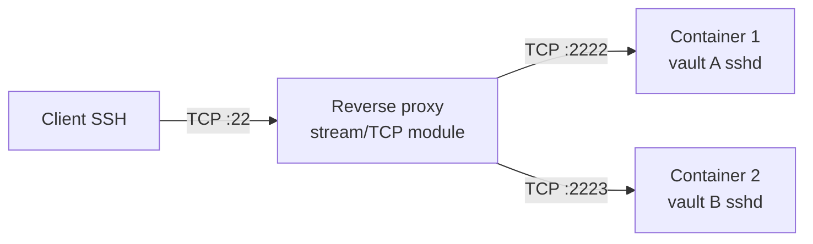

# Reverse proxy in front of Docker sshd

Front the [[en/server/docker|Docker turn-key sshd]] with a reverse proxy so multiple users / multiple vault containers / TLS termination can co-exist on one public host. Useful for: family-vault hosting, small-team deployments, hosting a vault under your own domain.

## When this is the right shape

The Docker setup ships one sshd container on one port (default 2222). For most personal use that's fine — point your laptop at `your-host:2222` and connect. You want this recipe when:

- You're running multiple vault containers (one per user / project) and want each to be reachable by a clean hostname rather than `:2222`, `:2223`, …
- You want TLS-terminated SSH-over-HTTPS (uncommon but exists, e.g. for restrictive networks)
- You already have nginx / Caddy / Traefik fronting other services and want to keep one ingress

## SSH does not speak HTTP

Important up front: SSH is a TCP stream protocol, **not HTTP**. Standard reverse proxies (nginx, Caddy in their default config) terminate HTTP. To proxy SSH you need their **stream / TCP** modules, which are a different config syntax.



Or, if you want a single port + container disambiguation by SNI / hostname, you need the SSH ProxyJump pattern instead — covered at the bottom.

## Recipe A — nginx stream module (one port per container)

`/etc/nginx/nginx.conf` (NOT in `http {}`; goes at the top level):

```nginx
stream {
  upstream vault_alice {
    server 127.0.0.1:2222;     # alice's container
  }
  upstream vault_bob {
    server 127.0.0.1:2223;     # bob's container
  }

  # Listen on different public ports per upstream
  server {
    listen 22001;
    proxy_pass vault_alice;
    proxy_protocol off;        # sshd doesn't speak PROXY protocol
  }
  server {
    listen 22002;
    proxy_pass vault_bob;
  }
}
```

Reload nginx:
```bash
sudo nginx -t && sudo systemctl reload nginx
```

In each user's plugin profile, set Host to the public host + the appropriate port (`your-host:22001`, `your-host:22002`).

## Recipe B — Caddy with `layer4` (single port, SNI-based routing)

Caddy's experimental [layer4 plugin](https://github.com/mholt/caddy-l4) can route TCP based on early-protocol bytes. SSH's first packet doesn't include an SNI field (it's not TLS), so true SNI routing isn't available, but you can match on **client IP** or **port-of-arrival** patterns.

For most use cases, the nginx-style "one port per upstream" is simpler. Use layer4 only if you have a constraint forcing single-port.

## Recipe C — ProxyJump (no proxy needed; the trick is in `~/.ssh/config`)

If you control the client side (your laptop), the cleanest setup is to skip the reverse proxy entirely and use SSH's native ProxyJump:

`~/.ssh/config` on the laptop:

```
Host bastion
  HostName your-public-host.example.com
  Port 22
  User bastion-user

Host vault-alice
  HostName 127.0.0.1
  Port 2222
  User obsidian
  ProxyJump bastion

Host vault-bob
  HostName 127.0.0.1
  Port 2223
  User obsidian
  ProxyJump bastion
```

Then in the plugin profile, set Host to `vault-alice` or `vault-bob` (the alias). Note: the plugin's "Import from SSH config" dropdown picks these up.

This avoids running a TCP proxy at all — SSH's own session multiplexing does the routing.

## TLS in front (SSH-over-WebSocket)

Some restrictive networks block port 22 outright. The workaround is to tunnel SSH through a TLS connection. There are a few ways:

- **`websocat` / `wstunnel`** — wrap the SSH stream in a WebSocket (over TLS), terminate at your nginx. The client side wraps + the server side unwraps.
- **`sslh`** — listens on port 443 and demuxes between SSH / HTTPS / OpenVPN based on the first packet's signature.

Out of scope for this recipe — these are full deployments in their own right. Search "SSH over HTTPS reverse proxy" for the current best-of-breed.

## Hardening checklist

- **Don't expose the raw container ports** publicly (`bind 127.0.0.1:2222` instead of `0.0.0.0:2222` in your docker-compose). Force traffic through your proxy.
- **Persistent host keys** — make sure each Docker container's host keys persist across recreate (the existing `deploy/docker` setup mounts a `hostkeys/` volume; preserve this when scaling to multiple containers).
- **Per-user `authorized_keys`** — one user per container with their own keys; don't share an `authorized_keys` file across containers if isolation matters.
- **Rate limiting** — fail2ban / nginx-side connection limits if you're internet-exposed.

## Plugin profile values

Whatever the proxy setup, the plugin profile values are simple:

| Field | What goes here |
|---|---|
| Host | Either the public hostname (Recipe A) or the SSH config alias (Recipe C) |
| Port | The proxy's listening port (A) or 22 with ProxyJump (C) |
| Username | Whatever the container's user is (`obsidian` for the default Docker setup) |

The plugin doesn't know it's behind a proxy — and it doesn't need to.

## See also

- [[en/server/docker|Server / Docker turn-key sshd]] — the sshd container this recipe fronts
- [[en/user-guide/jump-host|Jump hosts]] — same idea as Recipe C but configured per-profile in the plugin instead of `~/.ssh/config`
- [[en/cookbook/share-via-tailscale|Share via Tailscale]] — alternative to reverse-proxy hosting (Tailscale handles the network without an exposed port)
