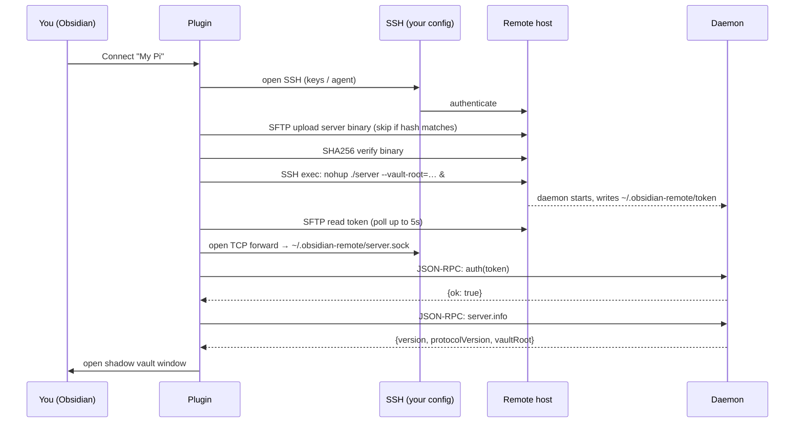

# First connect — what's actually happening

The five-minute [[en/getting-started/quickstart|Quickstart]] glosses over what "connect" does. This page goes through it step-by-step so the first time something breaks, you know where to look.

## The shadow vault model

obsidian-remote-ssh does not edit your remote files directly through Obsidian's vault layer. Instead it:

1. Creates a **local shadow vault** under `<plugin-dir>/shadow-vaults/<profile-id>/`. This is a real Obsidian vault on your local disk.
2. Mirrors the remote vault's files into that shadow vault (lazily — large files are fetched on first open).
3. Watches both sides for changes and syncs them through the SSH-tunneled daemon RPC.

Result: Obsidian thinks it's editing a local vault. All Obsidian features (Dataview, Templater, Excalidraw, …) work because they ARE working against a local vault. The "remote-ness" lives in the sync layer, invisible to most plugins.

See [[en/architecture/shadow-vault|Shadow vault architecture]] for the full design.

## What gets installed where

### On your local machine
```
<vault>/.obsidian/plugins/obsidian-remote-ssh/    # plugin bundle (main.js, manifest.json, styles.css)
<vault>/.obsidian/plugins/obsidian-remote-ssh/
    shadow-vaults/<profile-id>/                   # shadow vault (real Obsidian vault on disk)
    server-bin/obsidian-remote-server-<os>-<arch> # bundled daemon binary, uploaded on connect
    settings.json                                 # plugin settings (profiles, keys, etc.)
    logs/                                         # JSONL operational logs
    telemetry/                                    # local-only counters (opt-in)
```

### On the remote host (under your remote user's `$HOME`)
```
~/.obsidian-remote/
    server                # daemon binary (uploaded from plugin)
    server.sock           # Unix socket the daemon listens on
    token                 # 32-byte auth token (mode 0600, daemon-generated)
    server.log            # daemon stdout/stderr
```

The plugin **never** writes outside `~/.obsidian-remote/` and the configured remote vault path.

## What flows over the wire

1. **SSH session** — established with your normal keys/agent. `~/.ssh/config` is honored (jump hosts, Host aliases, IdentityFile).
2. **SFTP subsystem** — used once per connect to upload the daemon binary and read the auth token file.
3. **TCP port-forward** — Local TCP socket → SSH → Unix socket on the remote (`~/.obsidian-remote/server.sock`). All RPC traffic flows over this tunnel.
4. **JSON-RPC 2.0** — see [[en/api/overview|API & protocol]] for the wire format.

Nothing leaves the SSH connection. No third-party servers, no STUN, no relay.

## Connect lifecycle



## After connect

- The daemon stays up across plugin reloads. If you close Obsidian and reopen within ~5 minutes, the next connect skips the binary upload entirely.
- If the daemon crashes, the plugin auto-restarts it on the next operation. Daemon panel surfaces the previous log.
- See [[en/operations/reconnect|Reconnect behavior]] for what happens when the SSH connection drops.

Next: [[en/user-guide/ssh-config|SSH config import]] or jump straight to [[en/configuration/profiles|Configuration reference]].
