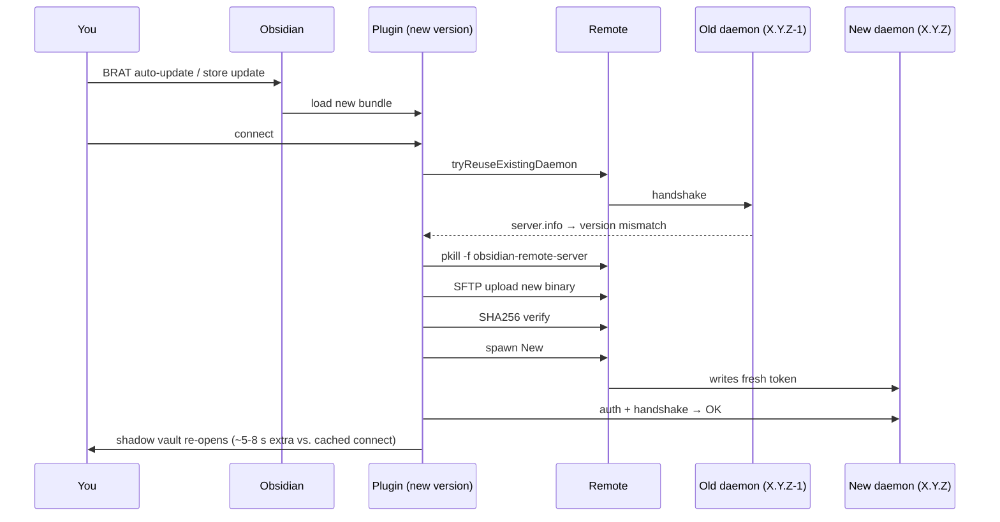

# Upgrading the plugin + daemon

The plugin and daemon are versioned together. Upgrading the plugin upgrades the bundled daemon binary; the next connect deploys it. **You usually do nothing on the remote.** This page covers the cases where that simple story breaks.

## The default path



The reuse probe in `tryReuseExistingDaemon` does an `auth` + `server.info` round-trip. If the daemon's `server.info.version` differs from what the plugin expects (the bundled binary's version), the reuse fails and the deploy fallback kicks in. Net effect: a one-time ~5–8 second redeploy on the first connect after upgrade. Subsequent connects reuse the new daemon as normal.

## Plugin upgrade paths

### Stable channel (Community Plugins store)

Settings → Community plugins → "Remote SSH" → **Update**. Obsidian downloads the new bundle and reloads the plugin. Reconnect any open shadow vaults to pick up the new daemon.

### Beta channel (BRAT)

BRAT auto-updates on Obsidian launch. Pin a specific version by toggling BRAT's "Auto-update at startup" off if you want to control upgrade timing.

### Manual install

Download the new release's `main.js`, `manifest.json`, `styles.css` from the [Releases](https://github.com/sotashimozono/obsidian-remote-ssh/releases/latest) page and replace the files under `<vault>/.obsidian/plugins/remote-ssh/`. Disable + re-enable the plugin in Obsidian to load the new bundle.

## When you DO need to touch the remote

### You're running a systemd-managed daemon

If you put the daemon under [[en/cookbook/systemd-managed-daemon|systemd]] and the running version is **older** than what the new plugin bundle expects, the reuse probe will fail and the plugin will redeploy over your systemd-managed binary. Three options:

1. **Let it redeploy** — accept that the systemd-managed binary gets overwritten by the bundled one. The systemd unit will re-execve into the new binary on its next restart.
2. **Pre-upgrade the binary** — download the matching new release binary, `cosign verify`, `sudo install` over the existing one, `systemctl --user restart obsidian-remote-server`. Then the reuse probe finds a healthy version-matched daemon and skips the upload.
3. **Pin your systemd binary version forever** — keep the plugin pinned to the matching version too. Useful only if you have a strong reason; usually means foregoing security patches.

### Daemon binary went stale (host was offline during multiple plugin upgrades)

Same flow as above — first connect after the host wakes up will see a version mismatch and redeploy. No manual action needed.

### Major-version daemon upgrade (protocol bump)

If a release bumps the protocol version (currently `protocolVersion: 1`; would become `2` for a breaking wire change), the reuse probe's handshake fails with `ProtocolVersionTooOld (-32021)`. The plugin then redeploys to bring the daemon to the matching protocol. This is the same code path as a normal version mismatch — handled automatically.

## Verifying the upgrade landed

In the plugin: **Settings → Daemon panel** → check the version badge.

The plugin-side version is at **Settings → Community plugins → Remote SSH** (Obsidian shows the manifest version).

For paranoia, check the binary on the remote:

```bash
ssh user@host '~/.obsidian-remote/server --version 2>&1 || strings ~/.obsidian-remote/server | grep -E "^[0-9]+\.[0-9]+\.[0-9]+" | head -1'
```

## Downgrading

The same machinery handles downgrades — the reuse probe sees a version mismatch in either direction and redeploys. To downgrade:

1. Obsidian: install the older plugin version (BRAT lets you pick a specific tag; manual install lets you `cp` an older release).
2. Connect — the plugin uploads its now-older bundled daemon, replacing the newer one.

The vault format is stable across the 1.x line, so downgrading is safe data-wise.

## What survives an upgrade

- **Vault contents** — untouched (lives on the remote)
- **Profiles** — persisted in `data.json`, survives plugin upgrade
- **Host-key trust** — persisted in `data.json` `hostKeyStore` key, survives
- **Plugin settings (font size, debug logging, etc.)** — persisted
- **Open shadow vault windows** — close on plugin reload; reopen via the command palette
- **Daemon log on remote** — survives unless you `rm -rf ~/.obsidian-remote/`

## What doesn't survive

- **Daemon token** — regenerated every daemon restart (the plugin re-reads it transparently)
- **Reconnect counters / queued ops** — reset on plugin reload

## See also

- [[en/architecture/release-pipeline|Release & deploy pipeline]] — version coherence + reuse-probe machinery
- [[en/cookbook/systemd-managed-daemon|systemd-managed daemon]] — relevant when you're not letting auto-deploy own the daemon binary
- [[en/operations/troubleshooting|Troubleshooting]] — what to check if connection fails after upgrade
- [[en/changelog|Changelog & releases]] — what's new in the version you're upgrading to
