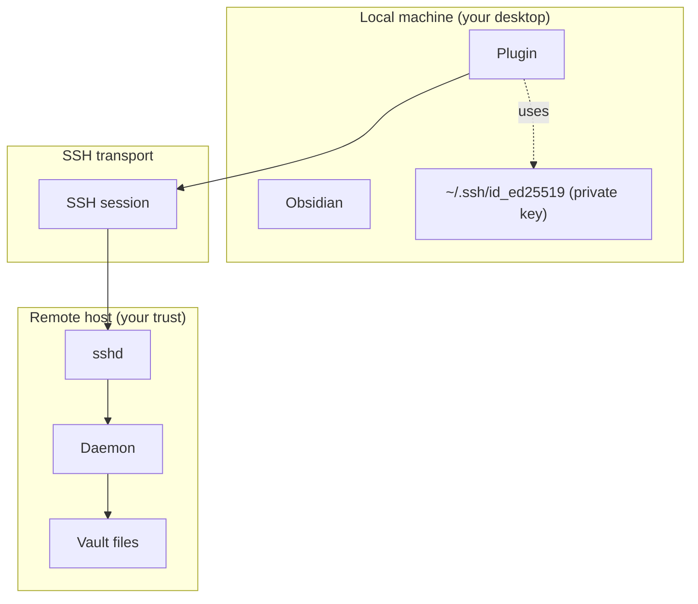

# Security — threat model

This page lays out what obsidian-remote-ssh defends against and what it doesn't. If you're operating in a higher-threat environment than the model assumes, you'll want extra defences.

## Trust boundaries

## What we defend against

| Threat | Defense |
|---|---|
| Network eavesdropping | All RPC + file content is inside the SSH session — same crypto as `ssh` itself |
| Remote login by an attacker | Standard SSH keys + your sshd's hardening (no plugin-specific extra surface) |
| Wrong host key (MITM, hostile DNS) | Plugin maintains its own known-host store; mismatch on a known host requires explicit override |
| Corrupted daemon binary on the wire | SHA256 round-trip after SFTP upload; mismatch fails the deploy |
| Tampered daemon binary at rest (you downloaded it from a third-party mirror) | [[en/security/cosign-verify\|Cosign verify]] proves it came from THIS repo's release pipeline |
| Plugin reading files outside the configured vault | Daemon refuses any path containing `..` or escaping the vault root via symlink (`PathOutsideVault`) |
| Token theft via shared filesystem | Token written mode `0600` under the daemon's home; only that user can read it |
| Concurrent edit conflicts | Per-write `expectedMtime` precondition; conflict surfaces as a UI prompt, not a silent overwrite |

## What we DON'T defend against

| Threat | Why |
|---|---|
| Compromised remote OS | If the remote is fully owned, the daemon is too — anything reading the vault from the daemon's perspective is fair game. Defence is your remote's hardening (sshd, firewall, OS updates). |
| Compromised local machine | If your local OS is owned, your SSH keys + plugin settings are too. The plugin doesn't add extra at-rest encryption; it relies on your OS's user account isolation. |
| Malicious sshd intercepting in real time | If you're worried about this, you've got bigger problems than this plugin can solve. The plugin's host-key store catches static MITM (cert swap); it does not catch a fully colluding sshd that can answer correctly during the verification round trip. |
| Side-channels on the host (other users reading the vault directory) | The daemon runs under your user; vault file permissions are whatever you set them to (typically 0644 / 0755). Use OS-level ACLs / encryption-at-rest for shared hosts. |

## Defence-in-depth recommendations

| Risk | Mitigation |
|---|---|
| Untrusted networks | Use Tailscale / WireGuard / a Cloudflare Tunnel as the transport bottom layer; SSH then runs inside the tunnel |
| Lost laptop | Disk encryption (FileVault, BitLocker, LUKS) — protects the SSH key + vault shadow |
| Long-lived agent forwarding | The plugin doesn't use agent forwarding for chained jumps — each hop authenticates independently. Don't enable it elsewhere unless you must. |
| Daemon binary supply chain | Verify the bundled binary with cosign (see [[en/security/cosign-verify\|Cosign verify]]) before pre-deploying via systemd; the auto-deploy path also SHA256-verifies post-upload but verifies less than a cosign check |

## Reporting vulnerabilities

GitHub Security Advisories: [obsidian-remote-ssh/security/advisories/new](https://github.com/sotashimozono/obsidian-remote-ssh/security/advisories/new). Coordinated disclosure preferred. See the [[en/security/cosign-verify|Cosign verify]] page for what a "patched release" looks like operationally.

Next: [[en/security/cosign-verify|Cosign verify]].
