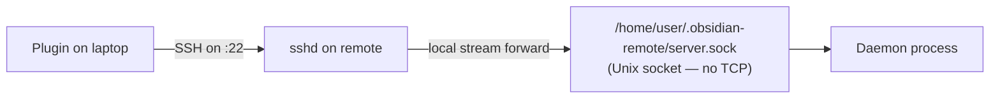

# Firewall, ports & NAT

What ports the plugin uses (and which it doesn't), how to expose a remote vault host across networks, and what to put in the firewall rules.

## TL;DR

**The plugin opens zero new network ports.** The daemon binds a Unix socket only — no TCP listener. All traffic flows through your existing SSH connection. If `ssh user@host` reaches your remote, the plugin reaches your remote.

## Why no extra port

The daemon uses `net.Listen("unix", ~/.obsidian-remote/server.sock)` per `server/cmd/obsidian-remote-server/main.go:99`. Unix sockets are filesystem objects, scoped to the local machine; they cannot be reached by network peers. The plugin connects to the socket via an SSH local stream forward (the `openUnixStream` call in `tryReuseExistingDaemon`), which tunnels socket bytes over the SSH session.



So the only port that needs to be open is the one your sshd already uses (typically 22, sometimes a custom port like 2222 for Docker).

## Common topologies

### Local network (same LAN)

No firewall changes needed. Your laptop connects directly:

```
laptop  ── LAN (192.168.x.0/24) ──  remote (192.168.x.50:22)
```

If the remote's host firewall is on (`ufw enable` on Ubuntu, etc.), allow inbound SSH:
```bash
sudo ufw allow ssh                # allows port 22
# or for a custom sshd port
sudo ufw allow 2222/tcp
```

### Behind home NAT (you're on the road, vault is at home)

Three sane options, in increasing order of "effort but worth it":

| Option | Effort | Trade-off |
|---|---|---|
| **Tailscale / Headscale / WireGuard mesh** | Low (one install per device) | Best path — no router changes, no public exposure. See [[en/cookbook/share-via-tailscale\|the Tailscale recipe]]. |
| **Cloudflare Tunnel / ngrok / boringproxy** | Medium | TLS-terminated reverse tunnel; the remote host dials out to the tunnel provider. No router config; depends on the provider. |
| **Port-forward 22 on your home router** | Medium-high (router config + harden sshd) | Direct internet exposure. Acceptable IF you've got pubkey-only auth, fail2ban, non-22 port number, and no password logins. Easy to misconfigure. |

For most users: **just use Tailscale**. It removes the entire NAT class of problems.

### Cloud VPS / managed host

The host has a public IP. Allow inbound SSH at the cloud provider's firewall layer (security group on AWS, firewall rule on Hetzner / DigitalOcean / OVH):

```
inbound TCP 22  from  0.0.0.0/0  → allow      (or restrict to your IP)
```

Stack a host-level firewall on top (`ufw allow ssh`) for defense in depth.

### Behind corporate NAT / restrictive network

If port 22 outbound is blocked (some corporate networks, hotel WiFi, etc.):

- **SSH over a custom port** — bind sshd to 443 or 8443; outbound 443 is almost universally allowed
- **SSH over WebSocket** — `wstunnel` / `websocat` wrap SSH in TLS; see the [[en/cookbook/reverse-proxy#tls-in-front-ssh-over-websocket\|TLS-in-front section of the reverse-proxy recipe]]
- **Tailscale's DERP relays** — Tailscale falls back to TLS relays automatically when direct UDP can't establish; works on most corporate networks

## What to NOT firewall

The plugin doesn't need:

- Any inbound port other than SSH on your remote
- Any outbound port from the daemon (it doesn't make outbound network calls)
- Any port on your laptop (the plugin is the SSH client, opens outbound only)

The Unix socket the daemon listens on (`~/.obsidian-remote/server.sock`) is filesystem-scoped — no `iptables` rule applies to it.

## Verifying the wire

From your laptop:

```bash
# Can you SSH at all?
ssh -v user@remote-host echo OK
# Should print "OK" with verbose handshake. If not, fix SSH first.

# Can the plugin reach the socket via the SSH forward?
# (Plugin does this internally; manual test for paranoia.)
ssh user@remote-host 'test -S ~/.obsidian-remote/server.sock && echo socket-OK'
# Should print "socket-OK" once the daemon is running.
```

If both succeed, the network path is fine. Any plugin failure beyond this is in the auth / RPC layer, not the firewall.

## Hardening sshd (since this is the only port)

Quick sanity on a non-trivially-exposed remote:

```ini
# /etc/ssh/sshd_config (or /etc/ssh/sshd_config.d/99-hardening.conf)
PasswordAuthentication no            # pubkey only
PermitRootLogin no                   # never login as root over SSH
KbdInteractiveAuthentication no
ChallengeResponseAuthentication no
MaxAuthTries 3
LoginGraceTime 30
ClientAliveInterval 60               # detect dropped clients
```

Reload: `sudo systemctl reload ssh` (or `sshd` on some distros).

Combined with fail2ban for brute-force defense and `ufw` allowing only your SSH port, this is sufficient for most home / personal-server scenarios.

## See also

- [[en/server/overview|Server overview]] — what the daemon needs from the host (no network requirements beyond what's listed there)
- [[en/cookbook/share-via-tailscale|Share via Tailscale]] — the recommended NAT-traversal path
- [[en/cookbook/reverse-proxy|Reverse proxy in front of Docker sshd]] — multi-tenant fronting + TLS-in-front
- [[en/security/model|Security threat model]] — what attack vectors SSH alone doesn't defend against
