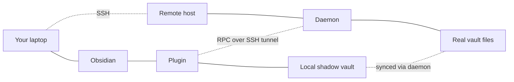

# Tutorial — zero to a working vault

A long-form walkthrough that takes you from "I just heard about this plugin" to "I'm editing notes on a remote server and trust the setup". About 20 minutes if you already have a server with SSH access; closer to an hour if you also need to set up the server.

This synthesises [[en/getting-started/install|Install]], [[en/getting-started/quickstart|Quickstart]], [[en/getting-started/first-connect|First connect]], and [[en/security/cosign-verify|Cosign verify]]. If you only want one of those, jump there directly.

## What we're going to build



By the end:

- A signed daemon binary running on a remote host you control
- An Obsidian window editing files that physically live on that remote
- The trust chain (host key, daemon binary signature) explicitly verified

## Step 1 — Install Obsidian + the plugin

If you don't have Obsidian: install it from [obsidian.md](https://obsidian.md). Open it once and create or open any vault — Obsidian needs a vault loaded for the plugin to install into.

Install the plugin via one of:

- **Stable** (Community Plugins store): Settings → Community plugins → Browse → search **Remote SSH**. Awaiting the store team's review at time of writing — see [[en/getting-started/install|Install]].
- **Beta** (BRAT): install BRAT, paste `sotashimozono/obsidian-remote-ssh` with **--beta**.

Enable it. You'll see a "Remote SSH" entry in Settings.

## Step 2 — Pick (or set up) a remote host

You need an SSH-reachable Linux or macOS host with:

- Your public SSH key in `~/.ssh/authorized_keys`
- A directory to use as a vault (can be empty)

Got one already? Skip ahead.

If not:

- **Cheapest**: a Raspberry Pi 4 + microSD on your home network — see [[en/cookbook/raspberry-pi-vault|Cookbook → Raspberry Pi vault]].
- **Cloud VPS**: any $5/month tier from Hetzner / DigitalOcean / OVH works fine; see [[en/cookbook/share-via-tailscale|Cookbook → Share via Tailscale]] for a sane way to reach it without exposing port 22 to the public internet.
- **Sandbox just to try**: clone the repo and run `cd deploy/docker && docker compose up -d --build`; see [[en/server/docker|Server → Docker]].

If `ssh user@host` works from a normal terminal, you're ready.

## Step 3 — Verify the daemon binary you're about to deploy (optional but recommended)

The plugin auto-uploads its bundled daemon binary on first connect. If you'd like to know what's getting uploaded, verify it with cosign first.

Find the bundled binary at `<your-vault>/.obsidian/plugins/remote-ssh/server-bin/obsidian-remote-server-linux-<arch>` after enabling the plugin. Match it against the signed manifest from the latest [release](https://github.com/sotashimozono/obsidian-remote-ssh/releases):

```bash
gh release download 1.0.43 --repo sotashimozono/obsidian-remote-ssh \
  --pattern 'daemon-manifest.json*'

cosign verify-blob \
  --bundle daemon-manifest.json.bundle \
  --certificate-identity-regexp \
    'https://github.com/sotashimozono/obsidian-remote-ssh/.github/workflows/release.yml@.*' \
  --certificate-oidc-issuer https://token.actions.githubusercontent.com \
  daemon-manifest.json
# → Verified OK

sha256sum '<vault>/.obsidian/plugins/remote-ssh/server-bin/obsidian-remote-server-linux-amd64'
grep linux-amd64 daemon-manifest.json
# Hashes should match.
```

For the full background on what cosign is checking, see [[en/security/cosign-verify|Cosign verify]].

## Step 4 — Add a profile

In Obsidian: Settings → Remote SSH → **Add profile**.

| Field | Value |
|---|---|
| Profile name | `My host` |
| Host | `192.168.1.50` (or your hostname / Tailscale name) |
| Port | `22` |
| Username | your remote user |
| Authentication | **SSH agent** (preferred) or **Private key** + path |
| Remote vault path | `/home/<you>/notes` (must exist) |
| Mode | `Daemon (deploys helper on connect)` |

Save.

## Step 5 — Connect for the first time

Command palette → **Remote SSH: Connect** → pick your profile.

What happens, in order:

1. **Host-key trust dialog** appears with the remote's fingerprint. Compare with the value from a different channel (a console session on the remote, your provider's web console, your previous `ssh` session's output) — see [[en/security/host-keys|Host-key trust]] for what each button does. Click **Trust & remember** when satisfied.

2. **Plugin uploads the daemon** to `~/.obsidian-remote/server` and verifies the SHA256 round-trip.

3. **Plugin starts the daemon** under your remote user. The daemon writes a 32-byte token to `~/.obsidian-remote/token` (mode 0600).

4. **A new Obsidian window opens** showing the contents of your remote vault.

First connect: ~5–8 seconds (binary upload). Subsequent connects: ~1 second.

## Step 6 — Verify it's actually editing the remote

In the new window, create a file `tutorial-test.md` with some content. Save (Ctrl-S / ⌘S).

In a separate terminal:
```bash
ssh user@host 'cat ~/notes/tutorial-test.md'
# → your content
```

The file is on the remote. There's no local copy outside the shadow-vault cache (which lives at `~/.obsidian-remote/vaults/<profile-id>/` on your laptop and is automatically managed).

## Step 7 — Edit from the other side

While the Obsidian window is open, on the remote:
```bash
ssh user@host 'echo "edit from terminal" >> ~/notes/tutorial-test.md'
```

Within ~500 ms, Obsidian's view should reflect the new line. That's the daemon's `fs.watch` subscription pushing the change through the SSH tunnel.

## Step 8 — Disconnect cleanly

Command palette → **Remote SSH: Disconnect**, or just close the shadow-vault window.

The daemon stays running on the remote for ~5 minutes (configurable) so a quick reconnect skips the binary upload + token re-read.

## What's next

You're done with the basic setup. Common next steps:

- **Conflicts**: read [[en/user-guide/conflicts|Conflict handling]] before two people / two devices touch the same vault — the resolution flow is unforgiving (no automatic backup of the rejected side).
- **Performance tuning** for large vaults: [[en/operations/troubleshooting|Troubleshooting]] (look at "Performance feels slow") + [[en/server/raspberry-pi|RPi notes]] if applicable.
- **Long-running daemon**: if you keep your remote on 24/7, [[en/cookbook/systemd-managed-daemon|systemd-managed daemon]] is worth the 10-minute setup.
- **Multiple devices editing the same vault**: works out of the box — each gets its own [[en/configuration/this-device|Client ID]] for workspace isolation. Conflict-resolution caveats apply (see above).

If something didn't work: [[en/operations/troubleshooting|Troubleshooting]] is the first place to look.
