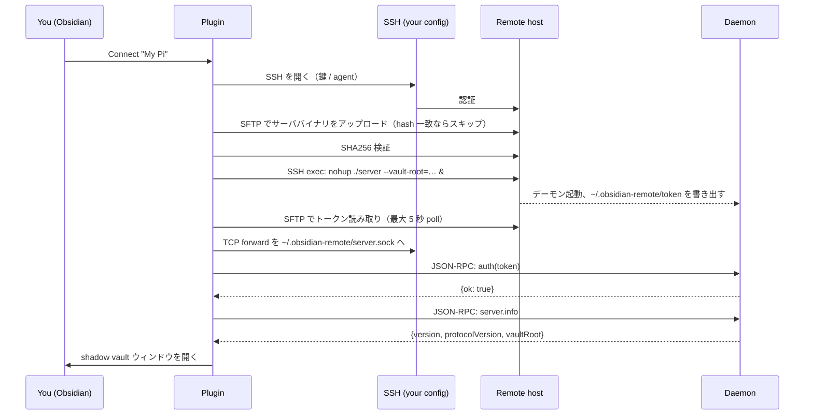

# 初回接続 — 裏で何が起こっているのか

## Shadow vault モデル

obsidian-remote-ssh は Obsidian の vault レイヤを経由してリモートファイルを直接編集**しません**。代わりに以下を行います:

1. ローカルディスク上に **shadow vault** を `<plugin-dir>/shadow-vaults/<profile-id>/` 配下に作成。これは**実体としての Obsidian vault** です。
2. リモート vault のファイルを shadow vault に**遅延ミラーリング**（大きいファイルは初回オープン時にフェッチ）
3. 両側を監視し、SSH トンネル経由のデーモン RPC で同期

結果: Obsidian は自分がローカル vault を編集していると認識します。Dataview / Templater / Excalidraw など全 Obsidian 機能が動作するのは、**実際にローカル vault を相手に動いている**からです。"リモート性" は同期レイヤに存在し、ほとんどのプラグインからは見えません。

設計の全体像は [[en/architecture/shadow-vault|Shadow vault architecture]]（英語）参照。

## 何がどこに配置されるか

### ローカルマシン
```
<vault>/.obsidian/plugins/remote-ssh/
    main.js                                       # プラグインバンドル
    manifest.json
    styles.css
    server-bin/obsidian-remote-server-<os>-<arch> # 接続時にアップロードされるデーモンバイナリ
    data.json                                     # プラグイン設定（profiles、ホスト鍵 など）
    console.log                                   # 動作ログ（5 MB × 4 file: console.log + .1 + .2 + .3）
    telemetry.jsonl                               # ローカル限定カウンタ（opt-in）

~/.obsidian-remote/vaults/<profile-id>/           # profile ごとの shadow vault（実体としての Obsidian vault）
```

### リモートホスト（リモートユーザの `$HOME` 配下）
```
~/.obsidian-remote/
    server                # デーモンバイナリ（プラグインからアップロード）
    server.sock           # デーモンが listen する Unix socket
    token                 # 32 バイト認証トークン（mode 0600、デーモン生成）
    server.log            # デーモンの stdout/stderr
```

プラグインは **`~/.obsidian-remote/` と設定済みのリモート vault パス以外には書き込みません**。

## ワイヤ上を流れるもの

1. **SSH セッション** — 通常使う鍵 / agent で確立。`~/.ssh/config` を尊重（jump host、Host alias、IdentityFile）
2. **SFTP サブシステム** — 接続ごとに 1 回、デーモンバイナリのアップロードと認証トークンファイルの読み取り用
3. **TCP ポートフォワード** — ローカル TCP socket → SSH → リモートの Unix socket（`~/.obsidian-remote/server.sock`）。RPC トラフィックはこのトンネル上を流れる
4. **JSON-RPC 2.0** — ワイヤフォーマットは [[en/api/overview|API & protocol]]（英語）参照

SSH 接続の外には何も漏れません。第三者サーバ、STUN、リレーは一切なし。

## 接続ライフサイクル



## 接続後

- デーモンはプラグインの reload を超えて生存します。Obsidian を閉じて約 5 分以内に再オープンすれば、次回接続はバイナリアップロードを完全にスキップします
- デーモンがクラッシュした場合、次の操作時にプラグインが自動再起動します。デーモンパネルに前回ログが表示されます
- SSH 接続が切れた場合の挙動は [[en/operations/reconnect|Reconnect behavior]]（英語）参照

次: [[en/user-guide/ssh-config|SSH config import]]（英語） または [[en/configuration/profiles|Configuration reference]]（英語）。
