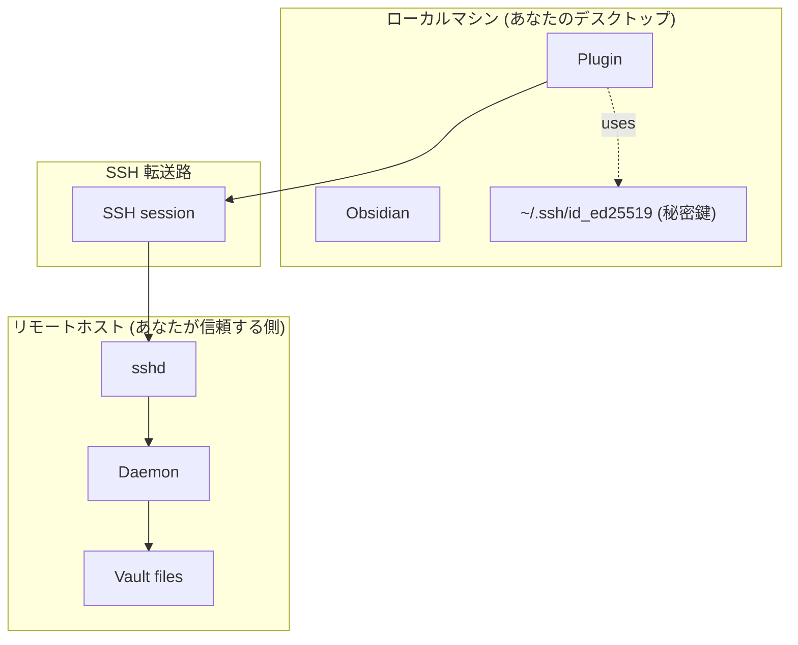

# セキュリティ — 脅威モデル

このページは obsidian-remote-ssh が**何を**防御し、**何を**防御しないかを示します。モデルが想定するより高い脅威環境にいる場合は、追加の防御を講じる必要があります。

## 信頼境界

## 防御するもの

| 脅威 | 防御方法 |
|---|---|
| ネットワーク盗聴 | RPC + ファイル内容すべてが SSH セッション内 — `ssh` 自体と同じ暗号 |
| 攻撃者によるリモートログイン | 標準 SSH 鍵 + あなたの sshd の堅牢化（プラグイン固有の追加サーフェスなし） |
| 不正なホスト鍵（MITM、悪意ある DNS） | プラグインが独自の known-host ストアを保持。既知ホストでのミスマッチは明示的な override 必要 |
| ワイヤ上での破損したデーモンバイナリ | SFTP アップロード後に SHA256 で round-trip 検証。ミスマッチは deploy 失敗 |
| 保存時に改竄されたデーモンバイナリ（第三者ミラーから取得した場合） | [[en/security/cosign-verify\|Cosign verify]]（英語）が **このリポジトリの** リリースパイプライン由来であることを証明 |
| 設定 vault 外のファイルをプラグインが読む | デーモンが `..` を含むパスや symlink で vault root を脱出するパスを拒否（`PathOutsideVault`） |
| 共有ファイルシステム経由のトークン窃取 | トークンはデーモンの home 配下に mode `0600` で書かれる — そのユーザのみ読める |
| 同時編集の衝突 | 書き込みごとに `expectedMtime` precondition。衝突は silent overwrite ではなく UI プロンプトとして表面化 |

## 防御しないもの

| 脅威 | 理由 |
|---|---|
| リモート OS が侵害された場合 | リモートが完全に乗っ取られているなら、デーモンも同様 — デーモン視点で vault を読むものはすべてフェアゲーム。防御はリモートの堅牢化（sshd、ファイアウォール、OS アップデート）に依存 |
| ローカルマシンが侵害された場合 | ローカル OS が乗っ取られているなら、SSH 鍵 + プラグイン設定も同様。プラグインは独自の保存時暗号化を追加せず、OS のユーザアカウント分離に依存 |
| リアルタイムで通信を傍受する悪意ある sshd | これを心配するなら、このプラグインで解決できる範囲を超えた問題があります。プラグインの host-key store は静的 MITM（証明書差し替え）を捕捉するが、検証 round trip 中に正しく応答してくる完全に共謀した sshd は捕捉しない |
| ホスト上のサイドチャネル（他のユーザが vault ディレクトリを読む） | デーモンはあなたのユーザ権限で動く。vault ファイルパーミッションはあなたが設定したまま（典型的には 0644 / 0755）。共有ホストでは OS レベル ACL / 保存時暗号化を併用 |

## 多層防御の推奨

| リスク | 対策 |
|---|---|
| 信頼できないネットワーク | Tailscale / WireGuard / Cloudflare Tunnel をトランスポート最下層に。SSH はその中で動く |
| ノート PC 紛失 | ディスク暗号化（FileVault、BitLocker、LUKS）— SSH 鍵 + vault shadow を保護 |
| 長寿命の agent forwarding | プラグインは chained jump で agent forwarding を使わない — 各 hop が独立に認証。他で必要なら個別に有効化 |
| デーモンバイナリのサプライチェーン | systemd で事前デプロイする前に cosign 検証（[[en/security/cosign-verify\|Cosign verify]]（英語） 参照）。auto-deploy 経路もアップロード後に SHA256 検証するが、cosign 検査より検証範囲は狭い |

## 脆弱性報告

GitHub Security Advisories: [obsidian-remote-ssh/security/advisories/new](https://github.com/sotashimozono/obsidian-remote-ssh/security/advisories/new)。協調的開示が望ましいです。「パッチリリース」が運用上どう見えるかは [[en/security/cosign-verify|Cosign verify]]（英語） 参照。

次: [[en/security/cosign-verify|Cosign verify]]（英語）。
