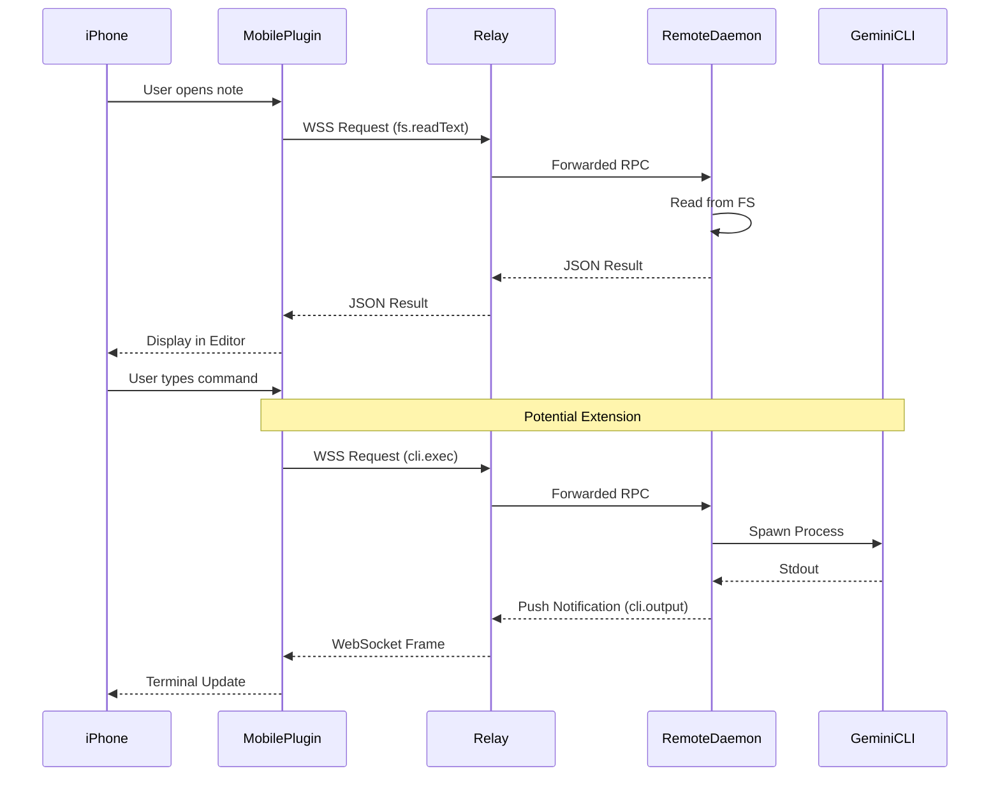

# Plan: Analysis of obsidian-remote-ssh for iPhone GeminiCLI Interface

## Objective
Analyze the `obsidian-remote-ssh` architecture to determine how it can be adapted to provide an iPhone interface for operating GeminiCLI and managing research documents.

## Key Components & Findings

### 1. Shadow Vault Architecture
The core innovation is the "Shadow Vault" which creates a local vault in Obsidian that contains zero actual data on disk, but is populated with `TFile`/`TFolder` objects via RPC calls to a remote Go daemon. This allows all Obsidian plugins (Dataview, Templater, etc.) to work on remote data as if it were local.

### 2. Desktop vs. Mobile Transport
- **Desktop**: Uses `ssh2` (Node.js library) for direct SSH connections and local port forwarding to a Unix socket on the remote.
- **Mobile**: Uses a `ws-relay` mode. Since mobile apps (Capacitor/WebView) cannot use Node.js `net` or `ssh2`, they connect via WebSocket to a relay server, which then connects to the remote host.

### 3. Remote Shell (Terminal)
The project includes a `RemoteTerminalView` using `xterm.js`. Currently, this depends on a direct `ssh2` shell channel.

## Proposed Strategy for GeminiCLI Interface

To use this for GeminiCLI on iPhone:
1.  **Document Management**: Use the existing `ws-relay` mechanism to map the remote project directory (where GeminiCLI lives) as an Obsidian Vault on the iPhone.
2.  **GeminiCLI Operation**:
    - **Option A (Terminal)**: Port the `RemoteShell` to work over the WebSocket relay. This would allow a full CLI experience on the iPhone.
    - **Option B (File-based)**: Create an Obsidian plugin "wrapper" that triggers GeminiCLI commands on the remote via new RPC methods, or by monitoring a specific "command file" (e.g., `gemini.cmd`).

## Documentation Drafts

### PROJECT_MAP.md
| Category | Component | Role | Tech |
|---|---|---|---|
| **Core** | `ShadowVault` | Proxies Obsidian Vault API to remote | TypeScript |
| **Server** | `obsidian-remote-server` | Go daemon on remote host | Go |
| **Transport** | `RpcRemoteFsClient` | JSON-RPC client (LSP framing) | TypeScript |
| **Mobile** | `WsRemoteFsClient` | Mobile-ready transport via WSS | TypeScript |
| **UI** | `RemoteTerminalView` | Integrated xterm.js terminal | TypeScript |

### DATA_FLOW.md

## Verification & Recommendations
- **Suitability**: High for document editing; requires relay implementation for iPhone.
- **Recommendation**: Focus on completing the `ws-relay` for basic file access first. For "operation", adding a `cli.exec` RPC method to the Go daemon would be more robust for mobile than raw PTY forwarding.
